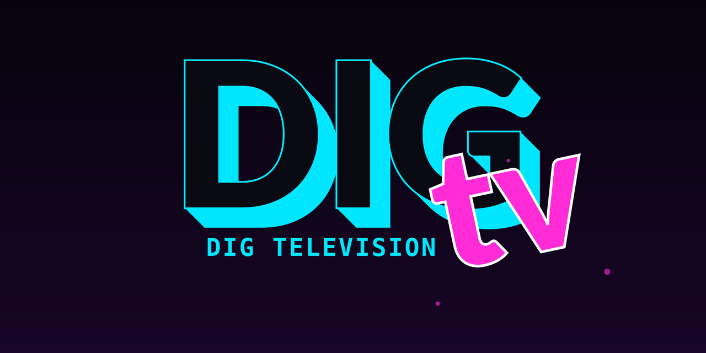
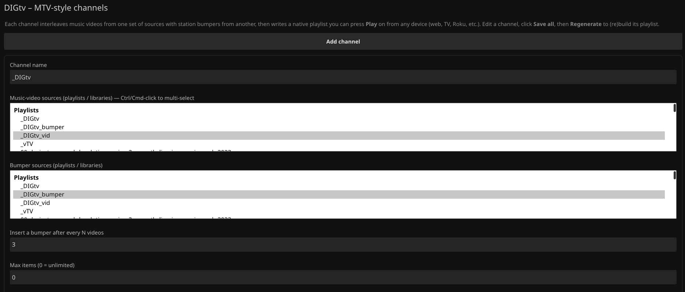
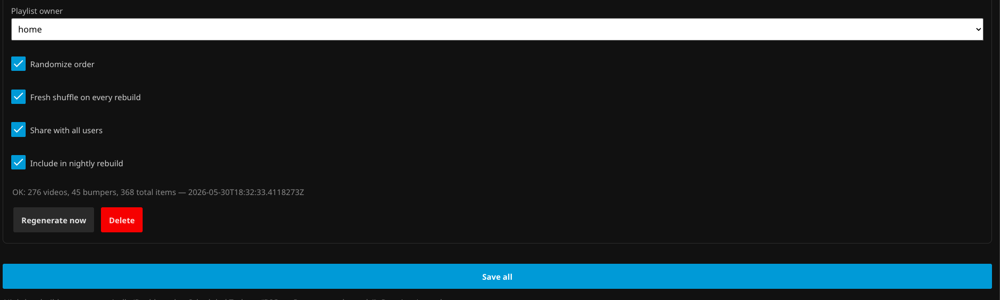

<p align="center">
  
</p>

<h1 align="center">DIGtv — MTV-style channels for Jellyfin</h1>

Turn your music-video library into a classic MTV experience. DIGtv interleaves
**music videos** (playlist A) with short **station bumpers / mini-commercials**
(playlist B) into a **native Jellyfin playlist** you press **Play** on. Because
it produces a standard playlist, it plays in order on **every client** — web,
Android TV, Roku, embedded smart-TV apps — with zero per-device setup.

## Features

- Pick **playlists or library folders** as music-video sources and as bumper sources.
- Set **how often** a bumper is inserted (every *N* videos).
- **Randomize** the order and **reshuffle** on every rebuild.
- Create **multiple independent channels**.
- **Per-channel** owner + "share with all users".
- Rebuild via a **"Regenerate now"** button or a nightly **scheduled task**.
- All data mirrored to `plugins/DIGtv/channels.json` for easy inspection.

## Settings

Manage everything from **Dashboard → My Plugins → DIGtv**: add channels, pick the
music-video and bumper sources, set the bumper frequency, and toggle randomize /
reshuffle / share — then **Save all** and **Regenerate now**.

| Create a channel | Per-channel options |
| --- | --- |
|  |  |

## How it works (design note)

Jellyfin's `IPlaylistManager.AddItemToPlaylistAsync` **de-duplicates** items, which
would collapse a channel's repeated bumpers. DIGtv therefore builds the exact
interleaved order and writes the playlist's `LinkedChildren` directly (then
`UpdateToRepositoryAsync` + `RefreshMetadata(ForceSave)`), the same way Jellyfin's
own `PlaylistManager` persists — using only public APIs. This is what lets the
same 5-second bumper appear hundreds of times in one channel. See
[ChannelService.cs](ChannelService.cs).

## Build

> **Pin the version first.** In `Jellyfin.Plugin.DigTv.csproj`, set both
> `Jellyfin.Controller` and `Jellyfin.Model` to **exactly** your server's version
> (Dashboard → Dashboard → About). A mismatch shows the plugin as *NotSupported*.

```bash
dotnet publish Jellyfin.Plugin.DigTv.csproj -c Release -o publish
# -> publish/Jellyfin.Plugin.DigTv.dll
```

Targets **Jellyfin 10.10.7** → requires the **.NET 8 SDK** and `Jellyfin.*` `10.10.7`
(set in the `.csproj`). For a 10.11.x server, retarget `net9.0`, pin `10.11.x`, and set
`targetAbi` to `10.11.0.0` in `meta.json`.

## Install via repository URL (recommended — works on the NAS, easy updates)

This is the standard way to install a third-party Jellyfin plugin: you host a
`manifest.json` on GitHub and paste its URL into Jellyfin once. Updates then show
up in the catalog automatically.

**One-time publish from this folder:**

1. Create a **public** repo on your `digunderground` GitHub account (e.g.
   `jellyfin-digtv`) and push this folder to it:
   ```bash
   git init && git add . && git commit -m "DIGtv 1.0.0"
   git branch -M main
   git remote add origin https://github.com/digunderground/jellyfin-digtv.git
   git push -u origin main
   ```
2. Cut a release by pushing a tag (the version must match `meta.json`):
   ```bash
   git tag v1.0.0.0 && git push origin v1.0.0.0
   ```
   The included GitHub Action ([.github/workflows/build.yml](.github/workflows/build.yml))
   builds the DLL, zips it with `meta.json`, creates a GitHub **Release**, then
   computes the MD5 and writes the version into **`manifest.json`** on `main`.
   (The Action prints the exact repository URL in its run summary.)

**Then in Jellyfin (web or TV — server-side, applies everywhere):**

3. **Dashboard → Plugins → Repositories → +** and add:
   ```
   https://raw.githubusercontent.com/digunderground/jellyfin-digtv/main/manifest.json
   ```
   (Adjust the URL if you named the repo differently. `raw.githubusercontent.com`
   caches for a few minutes, so a freshly pushed update can take ~5 min to appear.)
4. **Dashboard → Plugins → Catalog → DIGtv → Install**, then restart Jellyfin.

To ship an update later: bump the version in `meta.json` + `.csproj`, commit, and
push a new `vX.Y.Z.W` tag. The catalog will offer the update.

## Install manually (no GitHub, quickest one-off)

1. Build locally (see below) to get `Jellyfin.Plugin.DigTv.dll`.
2. Find your Jellyfin **plugins** folder on the NAS:
   - **Docker** (jellyfin/jellyfin or linuxserver): the mapped config volume, e.g.
     `/volume1/docker/jellyfin/config/plugins`.
   - **Package Center install**: typically `/volume1/@appdata/Jellyfin/plugins`
     (or `/volume1/@appstore/Jellyfin/.../plugins`). Confirm over SSH with
     `find /volume* -type d -name plugins -path '*ellyfin*'`.
3. Create a subfolder `DIGtv` and copy in **`Jellyfin.Plugin.DigTv.dll`** and **`meta.json`**.
4. Restart Jellyfin. The plugin appears under **Dashboard → My Plugins → DIGtv**.

## Use

1. **Dashboard → My Plugins → DIGtv**.
2. **Add channel** → name it, select music-video source(s) and bumper source(s),
   set the bumper frequency, toggle randomize/reshuffle/share, pick an owner.
3. **Save all**, then **Regenerate now**.
4. On any device, open **Playlists**, find the channel by name, press **Play**.

## Notes & limits

- Sources must contain items Jellyfin treats as **video** (music videos qualify).
- Deleting a channel removes its definition but **not** the generated playlist
  (delete that from the library if you want it gone).
- A channel reuses the same playlist across rebuilds, so favorites/resume survive.
